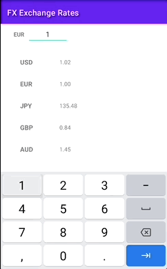
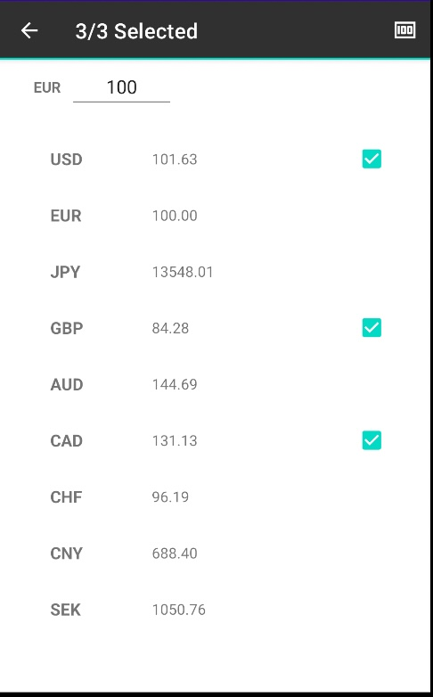
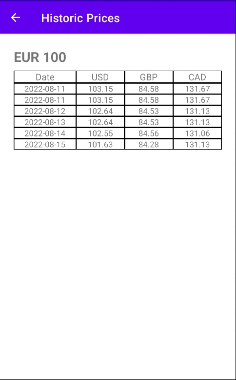
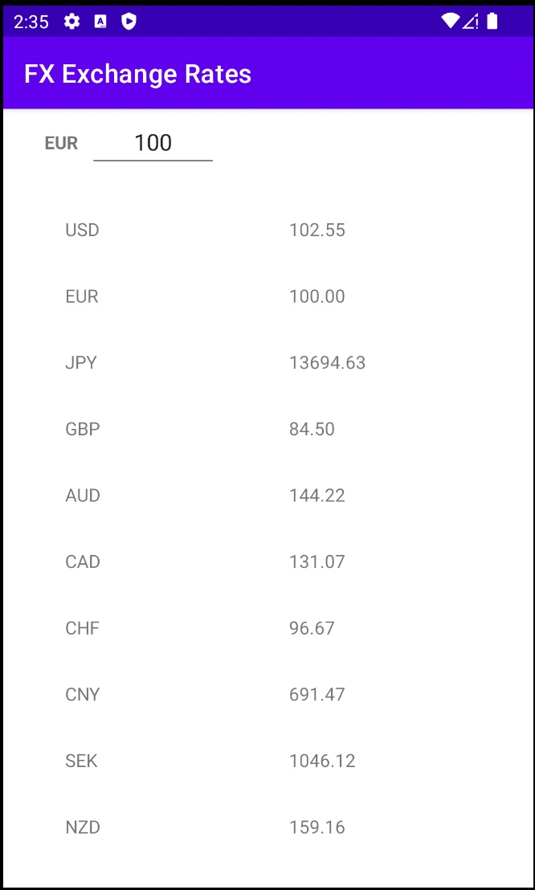

# Currency-Converter
 
Howdy! This is a simplistic currency converter application which allows for it's users to seamlessly
convert Euros to a multitude of other currencies in the world and it achieves this in a reactive way.
The application currently targets Android API version 21 and above.

Disclaimer: This is also one of my first Kotlin Flow / Coroutine applications after having used 
RXJava for quite some time, so there was a learning curve there and things I feel I can definitely 
improve further upon. 

Technologies used for the task:

- Kotlin 
- Dependency Injections (Hilt & Modularisation)
- Navigation Components
- Retrofit
- Android-X RecyclerView:Selection 
- Coroutines, Kotlin Flows & LiveData
- Espresso, Mockito and Junit

Here is a showcase of some of the applications features: 

### Showcase

Image updating the value which we would like to convert.

Image showcasing the multi-select RecyclerView functionality.

Image showcasing multiple currencies and their price history.  

Image showcasing single currency and it's price history.

Image showcasing the application home screen. 

I actually ran out of time to work further on this project, but I am hoping to expand this with the following at a later date:

- Implement a Retrofit Mock Server for UI tests
- Finish integrating all of my mock test cases.

And that is all folks! Thank you for stopping by.

