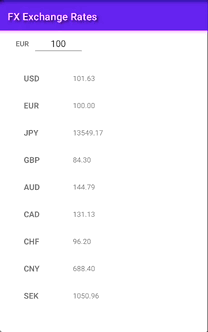

# Currency-Converter
 
Howdy! This is a lightweight currency converter application which allows for it's users to seamlessly
convert Euros to a multitude of other currencies in the world and it achieves this in a reactive way.
The application currently targets Android API version 21 and above.

Disclaimer: This is also one of my first Kotlin Flow / Coroutine applications after having used 
RXJava for quite some time, so there was a learning curve there and things I feel I can definitely 
improve further upon. 

Technologies used for the task:

- Kotlin 
- Dependency Injections (Hilt with Hilt modules)
- Navigation Components
- Android-X RecyclerView:Selection 
- Coroutines & Kotlin Flows
- Retrofit & Retrofit Mock Server
- Espresso, Junit, Barista & Turbine

Here is a showcase of some of the applications features: 

### Showcase

Image updating the value which we would like to convert. 

Image showcasing the multi-select functionality and navigating to the currency history page.  

Image showcasing a single currency and it's price history. 

Image showcasing multiple currencies and the price history.  

 
 

And that is all folks! Thank you for stopping by.

